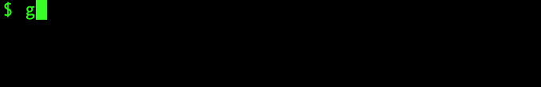

# go-spinner

[](https://pkg.go.dev/github.com/tiagomelo/go-spinner)


`go-spinner` is a simple and customizable spinner component for CLI applications written in Go. It provides a visual indicator for long-running tasks, making your command-line tools more user-friendly.

## features

- customizable spinner character sets
- support for different output writers (e.g., `os.Stdout`, `os.Stderr`, `bytes.Buffer`)
- easy to integrate and use
- option to disable spinner for non-terminal outputs

## usage

### using the default configuration

[examples/defaultoptions/main.go](examples/defaultoptions/main.go)

```
package main

import (
	"fmt"
	"time"

	"github.com/tiagomelo/go-spinner"
)

func main() {
	sp := spinner.New("executing task 1...")
	sp.Start()
	time.Sleep(3 * time.Second)
	sp.Stop()
	sp = spinner.New("executing task 2...")
	sp.Start()
	time.Sleep(3 * time.Second)
	sp.Stop()
	fmt.Println("done")
}
```

output:



### customizing it

[examples/withoptions/main.go](examples/withoptions/main.go)

```
func main() {
	sp := spinner.New("executing task 1...",
		spinner.WithClassicCharset(),
		spinner.WithConcludedChar("◆"),
		spinner.WithFrameRate(100*time.Millisecond),
	)
	sp.Start()
	time.Sleep(3 * time.Second)
	sp.Stop()

	sp = spinner.New("executing task 2...",
		spinner.WithCirclesCharset(),
		spinner.WithConcludedChar("★"),
		spinner.WithFrameRate(200*time.Millisecond),
	)
	sp.Start()
	time.Sleep(3 * time.Second)
	sp.Stop()

	// in this one we'll capture the output
	// to demonstrate the WithWriter option.
	// notice that in this case we're using a buffer,
	// so no animation will be displayed.
	var buf bytes.Buffer
	sp = spinner.New("executing task 3...",
		spinner.WithArrowsCharset(),
		spinner.WithConcludedChar("➜"),
		spinner.WithFrameRate(120*time.Millisecond),
		spinner.WithWriter(&buf),
	)
	sp.Start()
	time.Sleep(3 * time.Second)
	sp.Stop()
	fmt.Println("captured output for task 3:", buf.String())

	fmt.Println("done")
}
```

output:


## available options

- `WithCharset`: sets the charset option for a spinner
- `WithClassicCharset`: sets the spinner to use the classic charset, `"|", "/", "-", "\\"` 
- `WithArrowsCharset`: sets the spinner to use the arrows charset, `"←", "↖", "↑", "↗", "→", "↘", "↓", "↙"` 
- `WithCirclesCharset`: sets the spinner to use the circles charset, `"◐", "◓", "◑", "◒"` 
- `WithBlocksCharset`: sets the spinner to use the blocks charset, `"▖", "▘", "▝", "▗"` 
- `WithConcludedChar`: sets the concludedChar option for a spinner 
- `WithFrameRate`: sets the frame rate option for a spinner
- `WithWriter`: sets the writer option for a spinner

## running unit tests

```
make test
```

## running linter

```
make linter
```

## contributing

Contributions are welcome! Please feel free to submit a pull request or open an issue if you have any suggestions or find any bugs.

## license

This project is licensed under the MIT License. See the [LICENSE](./LICENSE) file for details.